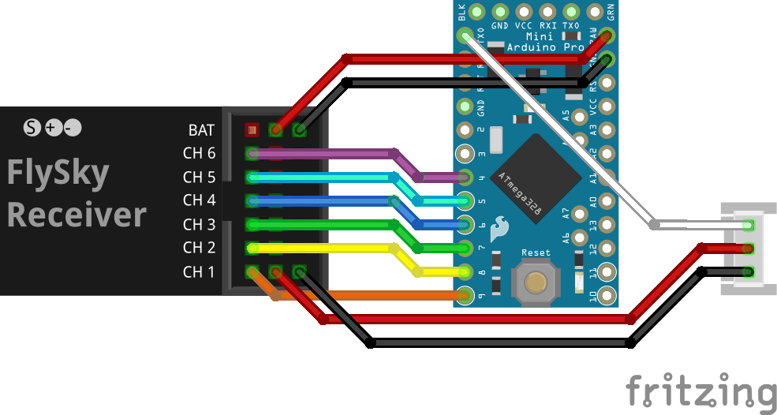

## Requirements

Arduino IDE.  
Arduino boards package for Arduino IDE.

Arduino Pro Mini 3.3V board.

RC receiver with up to 8 PWM output channels.  

Wires: 24AWG...30AWG.

## Compilation

Run Arduino IDE.  
Open "pwm_to_sbus_pro_mini_3v3.ino".  
Select board -> "Arduino Pro or Pro Mini".  
Tools -> Processor -> "ATmega328P (3.3V, 8 MHz)".  
Sketch -> Verify/Compile.  
Sketch -> Upload.  

## Connection

Connect directly to the RCIN(SBUS) port of the controller.

TXD pin (arduino pin 1), white: 3.3V SBUS output  
RAW pin, red: 5V power input  
GND pin, black: GND  

Arduino pins 2 to 9: PWM inputs.  
CH1: pin 9  
...  
CH8: pin 2  
